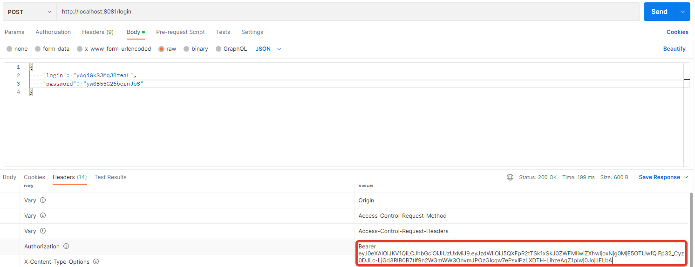
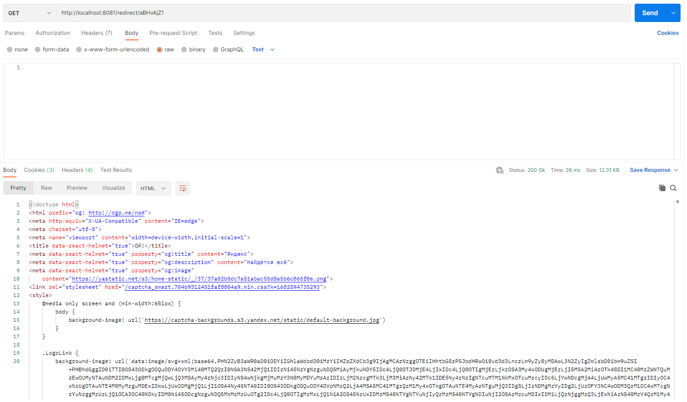
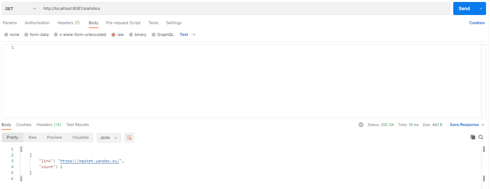

# job4j_url_shortcut

## Описание проекта
Данный проект представляет собой сервис для управления безопасностью URL-адресов.
Сервис работает через REST API.
Сервисом могут пользоваться разные сайты. Каждому сайту выдается пара: логин и пароль.
Авторизация сделана через JWT. Пользователь отправляет POST запрос с логином, паролем и получает ключ.
Поле того, как пользователь зарегистрировал сайт, можно отправлять ссылки и получать преобразованные.
Сервис считает количество вызовов каждого адреса, поэтому можно получить статистику вызовов сайта.

## Стек технологий
* Java 17
* PostgreSQL 14
* Apache Maven 3.8.5
* Spring Boot 2.7.5
* Lombok 1.18.24
* Checkstyle 10.7.0
* Liquibase 3.6.2
* JSON Web Token 3.4.0

## Требуемое окружение для запуска проекта
* JDK 17
* Apache Maven 3.8
* PostgreSQL 14

## Инструкция по запуску проекта
1) Скачать и разархивировать проект
2) В PostgreSQL создать базу данных cinema (url = `jdbc:postgresql://127.0.0.1:5432/job4j_url_shortcut`)
3) Открыть командную строку и перейти в папку с проектом, например `cd c:\projects\job4j_url_shortcut`
4) Выполнить команду `mvn install`
5) Перейти в папку target командой `cd target`
6) Выполнить команду `java -jar job4j_url_shortcut-0.0.1-SNAPSHOT.jar`

## Взаимодействие с приложением
### Отправляем запрос на регистрацию сайта и получаем логин, пароль

### Проходим авторизацию, используя полученные логин, пароль, и получаем ключ

### Теперь можно отправить ссылку и получить укороченный закодированный вариант

### Далее отправляем сервису сгенерированный код и получаем нужную страницу

### В сервисе есть возможность посмотреть число обращений к конкретному сайту

## Контакты для связи
&nbsp;&nbsp;
&nbsp;&nbsp;
